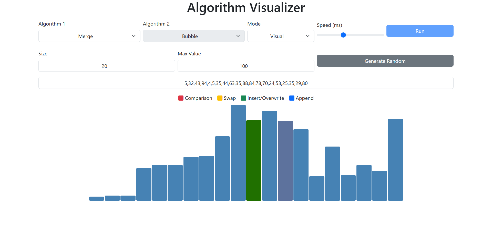
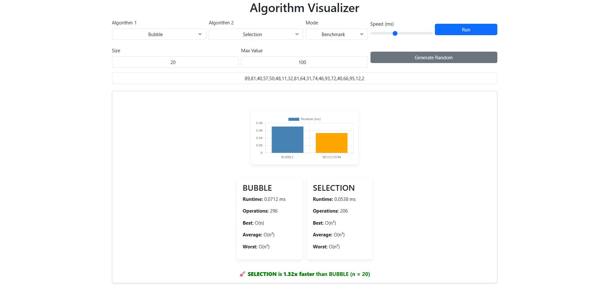

# Algorithm Visualizer

A web-based algorithm visualizer built with **Flask**, **Python**, and **JavaScript**.

---

## Project Description

This application allows users to:
- Visualize sorting algorithms step-by-step
- Compare algorithm performance
- Analyze time complexity
- Benchmark runtime and operation counts

This project was built to:
- Understand how sorting algorithms work internally
- Visualize algorithm behavior in real-time
- Compare theoretical complexity vs actual runtime
- Strengthen full-stack development skills

The application supports both:
- **Visual Mode** – animated step-by-step sorting
- **Benchmark Mode** – runtime and operation comparison

---

## Supported Algorithms

- Bubble Sort
- Selection Sort
- Insertion Sort
- Merge Sort

Each algorithm includes:
- Operation counting
- Time complexity analysis
- Step tracking for animation

---

## Features
### Visualization

* Dynamic bar width (responsive to array size)
* Color-coded highlights:
    * 🔴 Comparison
    * 🟠 Swap
    * 🟢 Insert / Overwrite
    * 🟡 Minimum index change
    * 🟣 Shift
* Adjustable animation speed
* Supports custom and randomly generated arrays

### Benchmark Mode

* Compare two algorithms side-by-side
* Runtime measurement (milliseconds)
* Operation count comparison
* Displays theoretical time complexities:
    * Best case
    * Average case
    * Worst case

### Backend Validation

- Input validation for numeric arrays
- Maximum array size protection
- Mode and algorithm validation
- Graceful error handling

---

## Tech Stack

* Backend
    * Python
    * Flask
* Frontend
    * HTML5
    * CSS3
    * Bootstrap 5
    * JavaScript (Vanilla)
    * Chart.js

---

## Installation

1. Clone this repository:

```bash
git clone https://github.com/harsij01/algorithm_visualizer
cd algorithm_visualizer
```

2. Create a Virtual Environment (Recommended)

Windows:
```bash
python -m venv venv
venv\Scripts\activate
```
Mac/Linux:
```bash
python3 -m venv venv
source venv/bin/activate
```

3. Install Dependencies

```bash
pip install -r requirements.txt
```

4. Run the Application

```bash
python app.py
```

5. Open in Browser

```bash
http://127.0.0.1:5000
```

## 📸 Screenshots

### Visual Mode


### Benchmark Mode
